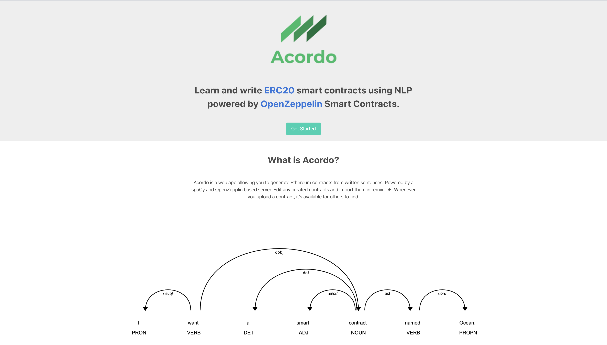

    

# Acordo

Built for the MIT 2020 Bitcoin hackathon

Smart contract generation based on human input text.

Built for the improving accessibility and contract development tools (sdk) challenges.

## Client
From the `acordo` directory:

<pre>
    yarn
    yarn start
</pre>

## Server
From the `./server` directory:

<pre>
    pip install -r requirements.txt
    python3 -m spacy download en_core_web_sm
    flask run
</pre>

### Screenshots

#### Home

#### Creating a contract
